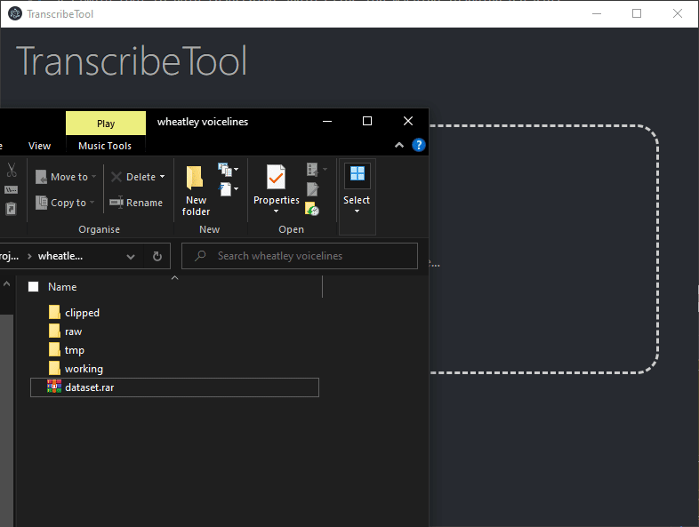
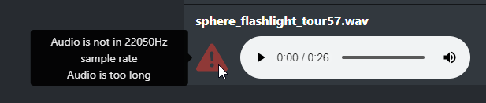
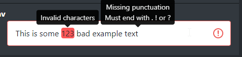
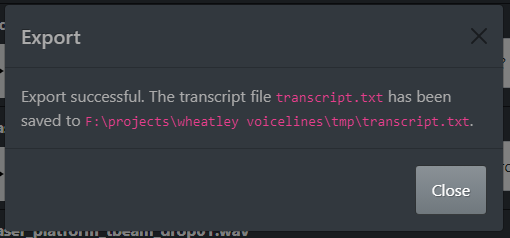

# TranscribeTool

A simple tool to help transcribe audio clips for machine learning datasets

Specficically, it was designed to make datasets for [Tacotron 2](https://github.com/NVIDIA/tacotron2) due to it's popularity with the [uberduck.ai](https://uberduck.ai/) community, so all the exported files and warnings are associated with making a good dataset for it.

## Download

You can always download the latest version from the [Releases Tab](https://github.com/underscoren/transcribetool/releases)

## Usage

You will need to load a folder containing all your wav files. You can do this via drag-and-drop:

You will see some stats about your audio, and a list containing all your audio files, with textboxes for you to transcribe the speech. **Anything you type is automatically saved** to a .txt file with the same name as your .wav file. Autosaves happen 1 second after you stop typing, as well as when you click away from the textbox.

If your audio files have problems, you will see a red triangle with an exclamation mark next to it. You can hover over the error symbol to get a list of all the problems your audio file has:

Note: You will have to fix the audio files yourself, and there is currently no way to "reload" the files. You will need to restart the application to load the audio files again.

If your transcript has problems, the characters will be marked red, and a tooltip will appear when you hover over the textbox, explaining what is wrong:

Once you're finished, simply hit the "Export transcript" button at the bottom of the page, and a file called `transcript.txt` will be created in the folder with all your wavs. 

You can then use this file in the tacotron training notebook.

## Building

If you want to build the app yourself, simply download the repo using 

    git clone https://github.com/underscoren/transcribetool.git 

Then, install all the dependencies using

    npm install

Finally, build the app using

    npm run make

The app will build into the `out` folder, usually as both the application files and an installer you can use for your system.

## TODO

  - Manual reload of audio files
  - Automatic detection when audio files are changed
  - Editing/Auto-fixing/Deleting audio clips
  - Custom export location
  - Icons

## License

The source code for this application is licensed under [MIT](https://github.com/underscoren/transcribetool/blob/master/LICENSE) and all the various libraries used contain their own licenses in their respective files.